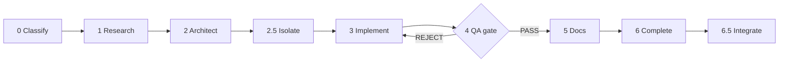

# hephaestus

[](https://github.com/Swissbit92/hephaestus/actions/workflows/ci.yml)

**hephaestus** is a [Claude Code](https://code.claude.com) marketplace of small, sharp
plugins — a workshop for keeping your craft sharp. Each plugin is self-contained, vendor-neutral,
and versioned independently, so you install only what you need and update it on its own cadence.

> Shared as-is by a single operator, with no support promised. Issues and pull requests are
> welcome but may go unanswered. Vendor-neutrality is enforced by `tests/test_seam.py` and
> `scripts/check-public-safe.sh`, not merely intended.

The flagship is **crucible**: a bundle of generic, domain-free craft tools that make AI-assisted
development *disciplined* rather than chaotic — a structured `develop` workflow with QA gates
between phases, a safe branch lifecycle (`start-branch` / `finish-branch` that never merges on a
red suite), documentation discipline (`cms`), a sparring partner for an idea you're still forming
(`spar-with-me`) and an adversarial decision-tester for once it's hardened (`grill-me`),
eval-first change-gating (`eval-first` + `flag-gate`, so a change has to match-or-beat its baseline
before it ships), a skill-authoring guide (`author-skill`), and `loop-harness` — a bounded,
single-threaded, **read-only** agent-loop primitive (turn/budget ceilings, a `LOOP-STATE` ledger,
a worktree-only safety hook, and a one-command CI sweep). Around it sit focused standalone plugins:
a zero-config read-only SQLite MCP server, an Obsidian inbox processor, a code-backed `.pptx` deck
builder, and a template for packaging your own MCP-server plugin.

One principle runs through all of it: **small, composable tools that earn their place** — pure
stdlib where possible, no hidden dependencies, each one tested and documented so an agent (or a
human) can pick it up cold.

## Contents

- [Plugins in this marketplace](#plugins-in-this-marketplace)
- [crucible plugin](#crucible-plugin)
- [The develop workflow](#the-develop-workflow)
- [Install](#install)
- [What's portable, what to adapt](#whats-portable-what-to-adapt)
- [cms state & persistence](#cms-state--persistence)
- [Requirements](#requirements)
- [Layout](#layout)
- [Releasing](#releasing)
- [Contributing](#contributing)
- [License](#license)

## Plugins in this marketplace

| Plugin | What it is |
|--------|------------|
| **crucible** | Generic craft tools: `cms`, `spar-with-me`, `grill-me`, `develop`, `start-branch`, `finish-branch`, `qa-gatekeeper`, `eval-first`, `flag-gate`, `author-skill`, `loop-harness`, `act-for-real`, `repo-audit` (detailed below). |
| **sqlite-readonly** | Zero-config read-only SQLite MCP server — query any local `.db` safely (3-layer read-only, schema introspection, NL→SQL). See [its README](plugins/sqlite-readonly/README.md). |
| **mcp-starter** | A minimal, working template for packaging a Python MCP server as a plugin (userConfig injection, inline servers, uv, first-run hook, `/setup`). See [its README](plugins/mcp-starter/README.md). |
| **second-brain** | Obsidian inbox processor — proposes tags/links/filing/actions per note, applies only what you approve (suggest-then-confirm). See [its README](plugins/second-brain/README.md). |
| **deck-builder** | Build polished `.pptx` decks from source material — code-backed (named layout methods, never hand-rolled geometry), with an outline-approval gate. See [its README](plugins/deck-builder/README.md). |

## crucible plugin

| Tool | Type | What it does |
|------|------|--------------|
| **cms** | skill + hook | Context Management System — standardizes docs across repos for AI-agent token efficiency. Frontmatter linting, ADR scaffolding, drift detection, staleness-based archival, enforced on `docs/*.md` edits via a `PreToolUse` hook. Also generates the **human** view: `render` turns any document into a self-contained HTML page with layout-checked diagrams (`archview` / `archflow` / `archplot`), and `site.py` builds a **multi-repo documentation site** from the markdown already sitting next to the code — a `site.toml` lists repositories and nothing else, on the rule that *a page exists if its sources exist*, so the nav can never promise a page nobody wrote. |
| **spar-with-me** | skill | Sparring partner for an idea you're still forming — mandatory internal *and* web research before any opinion, clarifying questions only where the answer would change the advice, a position that moves on new evidence but never on restated preference, and a strictly **read-only** session (nothing is written until you ask). Hands off to `grill-me` once the idea becomes a decision. |
| **grill-me** | skill | Adversarial stress-test of a decision you've already reached, before you commit to it (assumption audit, pre-mortem, outside view, falsifiable tripwires). Needs a position to attack — while one is still forming, that's `spar-with-me`. |
| **develop** | command | A structured development workflow — classify → research → architect → isolate → implement → QA → docs → completion → integrate, with gates between phases. |
| **start-branch** | skill | Isolate work before implementing — detects the repo's integration target (never hardcoded), picks a plain branch vs. git worktree, names it Conventional-Branch style, records a clean test baseline, confirms in one line. Used by `develop`'s ISOLATE phase (2.5). |
| **finish-branch** | skill | Close out a branch/worktree safely — gates on tests, offers merge / PR / keep / discard, PR-by-default for deploy branches, cleans up without losing unmerged work (`-d` never `-D`, informed discard). Used by `develop`'s INTEGRATE phase (6.5). |
| **qa-gatekeeper** | agent | Skeptical QA gate used by `develop`'s Phase 4 — verifies stated changes, hunts bugs/orphaned code, runs tests, and returns PASS / CONDITIONAL PASS / REJECT. |
| **eval-first** | skill | Eval-first development — freeze a baseline, then gate every change on match-or-beat-or-revert. Deterministic-first checks → swap-augmented blind A/B judge (with self-grading guard) → `verdict`. Generic stdlib scripts + scaffolding templates; domain scorers plug in via injected `judge_fn`/`embed_fn`. |
| **flag-gate** | skill | Default-OFF feature-flag rollout with instant revert — ship behind a flag, keep the legacy path byte-identical, flip only on an eval-first gate, revert by flipping off, retire after soak. Pairs with `eval-first`. |
| **author-skill** | skill | Guide + scaffolder for writing a high-quality skill/plugin — lays out the authoring patterns (with real exemplars) and creates a pre-structured `SKILL.md` via `scripts/new_skill.py`. User-invoked. |
| **loop-harness** | skill | Run a bounded, single-threaded, **read-only** agent loop safely — hard turn/budget ceilings + cost log (`loop_budget`), a `LOOP-STATE` ledger for memory (`loop_ledger`), a `PreToolUse` safety hook that blocks merge/push/out-of-worktree while a loop is armed (`loop_hook`), a test-log summarizer (`loop_logscan`), and `loop_sweep` — one command for a read-only CI sweep → needs-me report. Single-threaded, *not* role-teams (evidence-backed). |
| **act-for-real** | skill | The inverse of `loop-harness`: for when you **must** act irreversibly on a **live system you often don't own** (money movement, credential rotation, one-way migration, registrar/DNS, real mail). Classify reversibility → bind authority to the *exact* action → never fabricate a real-world identifier → **verify from a fresh read, not from the call** → emit an `ACTION RECORD` or say `UNVERIFIED`. Fires rarely by design (evidence-backed). |

## The develop workflow

`develop` is the spine the other crucible tools hang off. It classifies a task
(FULL / LIGHT / TRIVIAL) and walks the matching phases, with a real gate between each —
no plan approval, no implementation; no green tests, no merge:



FULL work runs every phase; LIGHT skips Research/Architect; TRIVIAL skips isolate/integrate.
Isolate/Integrate call **start-branch**/**finish-branch**; the QA gate is **qa-gatekeeper**;
docs go through **cms**; LLM-backed or behavior-changing steps slot in **eval-first**/**flag-gate**.

## Install

```
/plugin marketplace add Swissbit92/hephaestus
/plugin install crucible@hephaestus            # generic craft tools
/plugin install sqlite-readonly@hephaestus      # read-only SQLite MCP server (needs uv)
/plugin install mcp-starter@hephaestus          # MCP-plugin template
```

Then the tools are namespaced under the plugin:

- `/crucible:cms` — run any CMS command (see the skill for subcommands)
- `/crucible:spar-with-me` — think an idea through with research and an honest take (read-only)
- `/crucible:grill-me` — stress-test a decision you've already reached
- `/crucible:develop` — run the development workflow
- `/crucible:start-branch` · `/crucible:finish-branch` — isolate / integrate work safely

`cms`, `spar-with-me`, and `grill-me` are also model-invoked: Claude triggers them automatically when their description matches what you're doing (editing docs, asking for an honest take on an idea, validating a decision).

## What's portable, what to adapt

- **spar-with-me / grill-me** — fully generic, work out of the box. They split by stage:
  `spar-with-me` while an idea is forming, `grill-me` once it's a decision.
- **cms** — generic engine. The `PreToolUse` hook gates `docs/*.md` edits. By
  default it scopes to the **current working directory**; set `CMS_ROOTS`
  (OS-path-separated list) to gate a fixed set of repos instead. Drift facts
  live in `state/sync_facts.yaml` and ship empty — add your own.
- **develop** — the workflow *structure* is generic; the per-repo specifics
  (critical-logic paths, test commands, alignment questions) are marked `<...>`
  for you to fill in. Its Phase 4 uses the bundled **qa-gatekeeper** agent; its
  optional ISOLATE/INTEGRATE phases call **start-branch**/**finish-branch**.
- **start-branch / finish-branch** — fully generic. They **detect** the host
  repo's branch model (reading its CLAUDE.md, then git) and never hardcode a
  target branch or naming convention, so they work unchanged across `dev→prod`,
  main-release, trunk-based, and GitHub-Flow repos.
- **qa-gatekeeper** — generic; infers the project's test command from the repo.
  Augment its quality standards with your repo's CLAUDE.md.

## cms state & persistence

CMS keeps a little state (CLAUDE.md size history, drift facts). Plugin updates
overwrite the cached plugin dir, so state resolves in this order:

1. `CMS_STATE_DIR` (explicit override)
2. `${CLAUDE_PLUGIN_DATA}/cms-state` (persists across plugin updates)
3. `<plugin>/skills/cms/state/` (local fallback)

## Requirements

- Claude Code with plugin support
- Python 3.9+ on `PATH` as `python3` (cms scripts are pure stdlib — no pip installs)

## Layout

```
hephaestus/
├── .claude-plugin/marketplace.json     # marketplace catalog (lists all plugins)
├── scripts/                            # release.sh · bump_version.py · new_skill.py · check-public-safe.sh
├── evals/                              # skill-eval harness (behavioral scenarios)
├── tests/                              # pytest suite
├── docs/                               # ROADMAP · decisions/ (ADRs) · research/ — cms-managed
├── VISION.md · CHANGELOG.md · CONTRIBUTING.md
└── plugins/
    ├── crucible/                        # flagship craft tools (see plugins/crucible/README.md)
    │   ├── .claude-plugin/plugin.json   # manifest + cms & loop-harness PreToolUse hooks
    │   ├── skills/{cms,spar-with-me,grill-me,start-branch,finish-branch,author-skill,eval-first,flag-gate,loop-harness,act-for-real,repo-audit}/
    │   ├── commands/develop.md
    │   └── agents/qa-gatekeeper.md
    ├── sqlite-readonly/                # read-only SQLite MCP server
    ├── mcp-starter/                    # MCP-plugin packaging template
    ├── second-brain/                   # Obsidian inbox processor
    └── deck-builder/                   # code-backed .pptx deck builder
```

## Releasing

The `version` in `plugin.json` is what triggers updates for installed users —
pushing commits without bumping it does nothing for them. Use the helper, which
keeps the manifest version and git tag in lockstep:

```bash
scripts/release.sh <plugin> patch            # 0.1.0 -> 0.1.1
scripts/release.sh <plugin> minor            # 0.1.0 -> 0.2.0
scripts/release.sh <plugin> major            # 0.1.0 -> 1.0.0
scripts/release.sh <plugin> 1.2.3            # explicit version
scripts/release.sh <plugin> patch --dry-run  # preview, change nothing
```

`<plugin>` is a directory under `plugins/` (e.g. `crucible`). Each plugin versions
independently under its own tag namespace `<plugin>-v<x.y.z>`. The script refuses to run
unless you're on `main` with a clean tree, validates the plugin, then commits, tags,
pushes, and creates a GitHub release with notes drawn from that plugin's commits since its
last tag. The version math lives in `scripts/bump_version.py` (unit-tested).

## Contributing

Contributions welcome. See [CONTRIBUTING.md](CONTRIBUTING.md) for the dev setup
(live-loading a plugin with `--plugin-dir`), the branch model, and the non-negotiable
secret-guard rule. In short: work on a feature branch (keep `main` releasable), and run
`pytest -q` and `scripts/check-public-safe.sh` clean before integrating.

## License

MIT — see [LICENSE](LICENSE).
